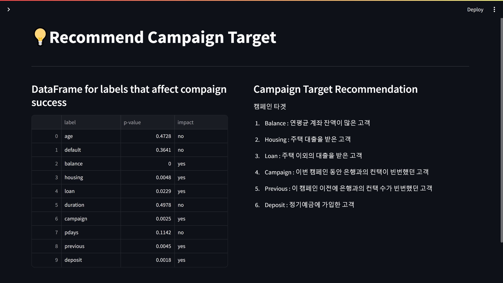
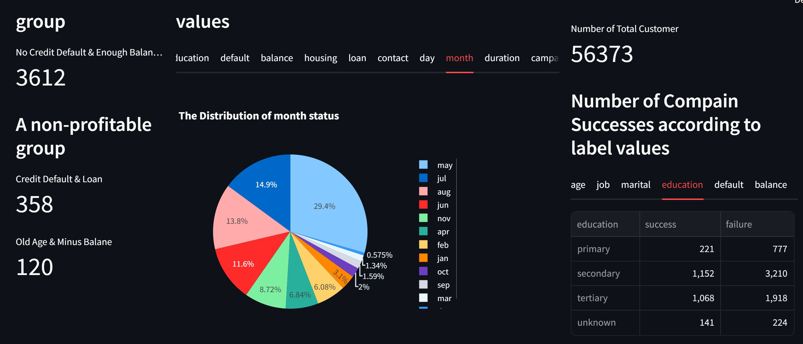
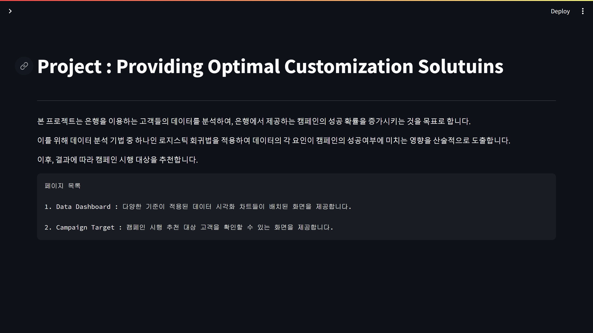
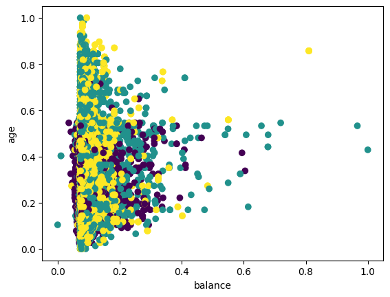

# likelion_1st_projcet

-*데이터 소스 : bank customer data (from kaggle)*
-*분석 목표 : provide customized services by using clustering*
_____________________________________________________________________________

*대시보드 구성*
1. 라벨 별 고객 분포를 보여주는 그래프 (완성)
2. 전체 고객수 / 이익 집단 / 불이익 집단 고객수(완성)
3. 라벨 별 캠페인의 성공과 실패 데이터 프레임 (완성)
4. 클러스터링을 통한 고객 군집화 결과 => 맞춤 솔루션 제안(유의미한 결과 도출 실패)
5. 각 라벨들이 캄페인의 성공/실패 여부에 영향을 미치는가 
-> 로지스틱회귀분석으로 알아보기(0과 1의 바이너리 데이터에 적용 가능)

_____________________________________________________________________________

*대시보드 이미지*

_____________________________________________________________________________

*데이터 셋 구성*
-The dataset consists of 17 columns, each representing the following attributes

|   label   | data type |  설명                                              |
| --------- | ----------| --------------------------------------------------- |
| age       | Int       | 나이                                                |
| job       | str       | 직업                                                |
| marital   | str       | 결혼 상태                                           |
| education | str       | 학력                                                |
| default   | bool      | 신용불량자 여부                                      |
| balance   | Int       | 연평균 계좌 잔액                                     |
| housing   | bool      | 주택 대출 여부                                       |
| loan      | bool      | 주택 이외의 대출 여부                                 |
| contact   | str       | 고객 연락처 유형                                     |
| day       | Int       | 해당 월의 마지막 연락일                               |
| month     | str       | 해당 연도의 마지막 연락 월                            |
| duration  | Int       | 마지막 접촉 기간(초)                                 |
| campaign  | Int       | 이 캠페인 동안 고객에 대해 수행된 컨택 수              |
| pdays     | Int       | 이전 캠페인에서 고객에게 마지막으로 연락한 이후의 일 수 |
| previous  | Int       | 고객에 대해 이 캠페인 이전에 수행된 컨택 수            |
| poutcome  | str       | 이전 마케팅 캠페인의 결과                             |
| deposit  | bool      | 정기예금 가입 여부                                   |

-data types
-Integer : 7
-String : 6
-Boolean : 4

_____________________________________________________________________________

*연속형 데이터로 클러스터링을 시도하였으나, 유의미한 결과가 나오지 않음*
K-means 클러스터링 기법을 사용해 k(군집)의 수를 다양하게 바꾸어 시도하였으나, 군집화가 잘 되지 않는 것을 확인하였다.

*로지스틱 회귀분석 코드는 아래 링크에서 확인 가능함*
https://colab.research.google.com/drive/1RMAFxpoj9D3hD-nN0Ex4CYZ1zKzikQYX?usp=sharing
